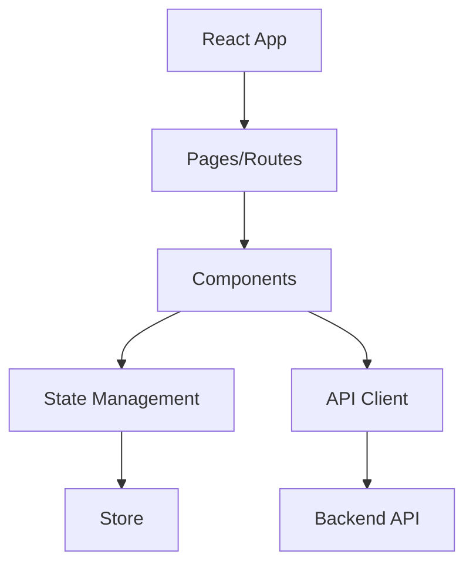

<div align="center">

# nexo

> Windows Nexo - Premium desktop widget inspired by iPhone Dynamic Island

[](#) [](#) [](#) [](#) [](#) [](#)

</div>

---

## 📖 Overview

This project is built with TypeScript using React, Tailwind CSS, Vite. The project includes a test suite.

---

## ✨ Features

- Built with React, Tailwind CSS, Vite
- Includes test suite

---

## 🏗️ Architecture



The React application uses a component-based architecture with centralized state management.

---

## 📁 Project Structure

```
├── bridge
│   ├── bridge_test_out.txt
│   ├── bridge.ps1
│   ├── dev.log
│   ├── final_test.txt
│   ├── fix_apis.ps1
│   └── test_apis.ps1
├── dist-electron
│   ├── win-unpacked
│   │   ├── locales
│   │   │   ├── af.pak
│   │   │   ├── am.pak
│   │   │   ├── ar.pak
│   │   │   ├── bg.pak
│   │   │   ├── bn.pak
│   │   │   ├── ca.pak
│   │   │   ├── cs.pak
│   │   │   ├── da.pak
│   │   │   ├── de.pak
│   │   │   ├── el.pak
│   │   │   ├── en-GB.pak
│   │   │   ├── en-US.pak
│   │   │   ├── es-419.pak
│   │   │   ├── es.pak
│   │   │   ├── et.pak
│   │   │   ├── fa.pak
│   │   │   ├── fi.pak
│   │   │   ├── fil.pak
│   │   │   ├── fr.pak
│   │   │   ├── gu.pak
│   │   │   ├── he.pak
│   │   │   ├── hi.pak
│   │   │   ├── hr.pak
│   │   │   ├── hu.pak
│   │   │   ├── id.pak
│   │   │   ├── it.pak
│   │   │   ├── ja.pak
│   │   │   ├── kn.pak
│   │   │   ├── ko.pak
│   │   │   ├── lt.pak
│   │   │   ├── lv.pak
│   │   │   ├── ml.pak
│   │   │   ├── mr.pak
│   │   │   ├── ms.pak
│   │   │   ├── nb.pak
│   │   │   ├── nl.pak
│   │   │   ├── pl.pak
│   │   │   ├── pt-BR.pak
│   │   │   ├── pt-PT.pak
│   │   │   ├── ro.pak
│   │   │   ├── ru.pak
│   │   │   ├── sk.pak
│   │   │   ├── sl.pak
│   │   │   ├── sr.pak
│   │   │   ├── sv.pak
│   │   │   ├── sw.pak
│   │   │   ├── ta.pak
│   │   │   ├── te.pak
│   │   │   ├── th.pak
│   │   │   ├── tr.pak
│   │   │   ├── uk.pak
│   │   │   ├── ur.pak
│   │   │   ├── vi.pak
│   │   │   ├── zh-CN.pak
│   │   │   └── zh-TW.pak
│   │   ├── resources
│   │   │   ├── app-update.yml
│   │   │   ├── app.asar
│   │   │   └── elevate.exe
│   │   ├── chrome_100_percent.pak
│   │   ├── chrome_200_percent.pak
│   │   ├── d3dcompiler_47.dll
│   │   ├── ffmpeg.dll
│   │   ├── icudtl.dat
│   │   ├── libEGL.dll
│   │   ├── libGLESv2.dll
│   │   ├── LICENSE.electron.txt
│   │   ├── LICENSES.chromium.html
│   │   ├── Nexo.exe
│   │   ├── resources.pak
│   │   ├── snapshot_blob.bin
│   │   ├── v8_context_snapshot.bin
│   │   ├── vk_swiftshader_icd.json
│   │   ├── vk_swiftshader.dll
│   │   └── vulkan-1.dll
│   ├── builder-debug.yml
│   ├── latest.yml
│   ├── Nexo Setup.exe
│   └── Nexo Setup.exe.blockmap
├── electron
│   ├── services
│   │   └── adminService.ts
│   ├── config.ts
│   ├── ipc.ts
│   ├── main.ts
│   ├── nativeBridge.ts
│   ├── preload.ts
│   └── tsconfig.json
├── electron-dist
│   ├── electron
│   │   ├── assets
│   │   │   ├── index-B_2ANzQl.js
│   │   │   ├── index-CzQEzzcq.js
│   │   │   └── index-x9HnSQYb.css
│   │   ├── services
│   │   │   └── adminService.js
│   │   ├── config.js
│   │   ├── index.html
│   │   ├── ipc.js
│   │   ├── main.js
│   │   ├── nativeBridge.js
│   │   └── preload.js
│   └── src
│       ├── ipc
│       │   └── channels.js
│       ├── system
│       │   ├── settings.js
│       │   └── startup.js
│       └── types
│           └── index.js
├── src
│   ├── animations
│   │   ├── config.ts
│   │   ├── springs.ts
│   │   └── transitions.ts
│   ├── components
│   │   ├── AIPanel.tsx
│   │   ├── BatteryWidget.tsx
│   │   ├── BrightnessWidget.tsx
│   │   ├── ClipboardWidget.tsx
│   │   ├── ContextMenu.tsx
│   │   ├── ControlToggle.tsx
│   │   ├── DownloadWidget.tsx
│   │   ├── IdleIsland.tsx
│   │   ├── MediaWidget.tsx
│   │   ├── MicIndicator.tsx
│   │   ├── NetworkWidget.tsx
│   │   ├── Nexo.tsx
│   │   ├── NotificationWidget.tsx
│   │   ├── QuickControlsPanel.tsx
│   │   ├── SettingsPanel.tsx
│   │   └── VolumeWidget.tsx
│   ├── hooks
│   │   ├── useBattery.ts
│   │   ├── useDevices.ts
│   │   ├── useLiveClock.ts
│   │   ├── useMedia.ts
│   │   ├── useNetwork.ts
│   │   ├── useNotifications.ts
│   │   ├── useQuickControls.ts
│   │   ├── useSettings.ts
│   │   ├── useSystemStreams.ts
│   │   └── useVolume.ts
│   ├── ipc
│   │   └── channels.ts
│   ├── store
│   │   └── islandStore.ts
│   ├── system
│   │   ├── settings.ts
│   │   └── startup.ts
│   ├── types
│   │   └── index.ts
│   ├── utils
│   │   ├── activities.ts
│   │   └── helpers.ts
│   ├── App.tsx
│   ├── index.css
│   ├── main.tsx
│   └── vite-env.d.ts
├── app.log
├── clicktest.ps1
├── dist_build2.log
├── electron-builder.js
├── index.html
├── install.ps1
├── installed.log
├── installed2.log
├── LICENSE
├── package.json
├── postcss.config.js
├── README.md
├── run_eb.cmd
├── tailwind.config.ts
├── tscheck.txt
├── tsconfig.json
├── tsconfig.renderer.json
├── vite.config.ts
└── wfptest.ps1
```

---

## 🚀 Getting Started

### Prerequisites

- Node.js >= 18

### Installation

1. **Clone the repository**
   ```bash
   git clone <repository-url>
cd <project-name>
   ```

2. **Install dependencies**
   ```bash
   npm install
   ```

3. **Build the project**
   ```bash
   npm run build
   ```


---

## 💡 Usage

### Running the project

Start the application:

```bash
npm start
```


---

## 📚 API Reference

### `resizeWindow`

```
function resizeWindow(width: number, height: number): void 
```

*Defined in `electron/main.ts`*

### `getMainWindow`

```
function getMainWindow(): BrowserWindow | null 
```

*Defined in `electron/main.ts`*

### `registerIpcHandlers`

```
function registerIpcHandlers(): void 
```

*Defined in `electron/ipc.ts`*


---

## 🤝 Contributing

Contributions are welcome! Here's how to get started:

1. Fork the repository
2. Create a feature branch (`git checkout -b feature/amazing-feature`)
3. Make your changes
4. Run the tests (`npm test`)
5. Commit your changes (`git commit -m 'Add amazing feature'`)
6. Push to the branch (`git push origin feature/amazing-feature`)
7. Open a Pull Request

---

## 📄 License

This project is licensed under the MIT License — see the [LICENSE](LICENSE) file for details.
