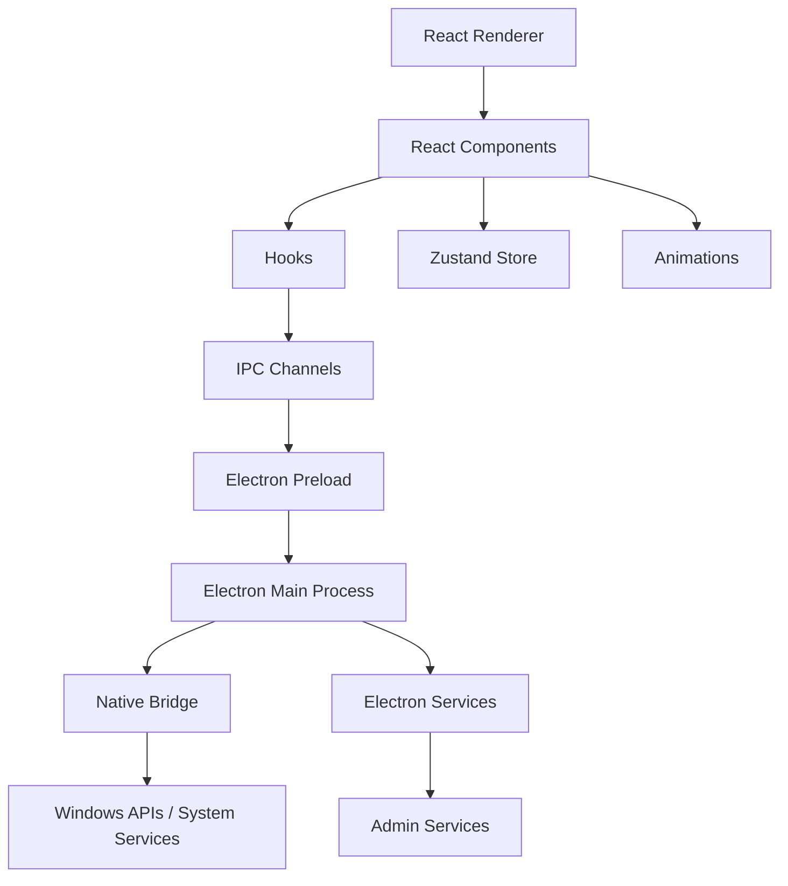

# Nexo

> **A premium Windows desktop widget inspired by Apple's Dynamic Island — built with Electron, React, TypeScript, and native Windows integrations.**

[](#)
[](#)
[](#)
[](#)
[](#)
[](#)
[](#license)

---

## ✨ Overview

**Nexo** brings a Dynamic Island-style experience to Windows.

Instead of being another traditional desktop widget, Nexo provides a small, adaptive interface that expands when something important happens and stays minimal when the system is idle.

It can surface system information and interactive controls such as:

* 🔊 Volume
* 🔆 Brightness
* 🔋 Battery
* 🌐 Network activity
* 🎵 Media playback
* 🎙️ Microphone activity
* 📋 Clipboard events
* 📥 Downloads
* 🔔 Notifications
* ⚡ Quick system controls
* 🤖 AI panel
* ⚙️ Application settings

The project is built as a **Windows desktop application using Electron**, with React handling the UI and a native bridge connecting the renderer to Windows/system-level functionality.

---

## 🎯 Why Nexo?

Windows has plenty of desktop widgets, but most behave like traditional panels or floating windows.

Nexo takes a different approach:

> **Keep the interface hidden when nothing needs attention and expand it when useful information becomes available.**

The goal is to combine:

**Minimal UI + System awareness + Smooth animations + Native Windows functionality**

into a single desktop experience.

---

## 🚀 Features

### 🎵 Media Widget

Displays currently playing media and provides interactive playback controls.

* Track information
* Playback state
* Play / pause
* Previous / next controls
* Dynamic expansion

### 🔊 Volume Control

Provides quick access to system volume directly from the Nexo interface.

### 🔆 Brightness Control

Adjust display brightness without opening Windows settings.

### 🔋 Battery Monitoring

Displays battery information and reacts to changes in battery state.

### 🌐 Network Monitoring

Shows network activity and connection information through a dedicated network widget.

### 🎙️ Microphone Indicator

Provides a visual indication when microphone activity is detected.

### 📋 Clipboard

Displays clipboard-related activity through the clipboard widget.

### 📥 Download Notifications

Surfaces download activity without requiring users to constantly check their browser.

### 🔔 Notifications

Displays system/application events through an expandable notification interface.

### ⚡ Quick Controls

Provides quick access to frequently used system controls through an expandable panel.

### 🤖 AI Panel

An integrated AI-oriented panel designed to provide an additional intelligent interaction layer inside the desktop widget.

### ⚙️ Settings

Includes a dedicated settings interface for configuring Nexo behavior.

### 🎨 Adaptive UI & Animations

Nexo uses spring-based animations and transitions to create a fluid expansion/collapse experience.

Animation configuration is separated into:

```text
src/animations/
├── config.ts
├── springs.ts
└── transitions.ts
```

---

## 🏗️ Architecture

Nexo follows an **Electron + React architecture** where the renderer, Electron main process, and native Windows functionality are separated.



### Application flow

```text
Windows System
      ↓
Native Bridge
      ↓
Electron Main Process
      ↓
IPC
      ↓
Preload
      ↓
React Renderer
      ↓
Nexo UI
```

This separation helps keep privileged system operations outside the React renderer.

---

## 📁 Project Structure

```text
nexo/
│
├── electron/
│   ├── services/
│   │   └── adminService.ts
│   ├── config.ts
│   ├── ipc.ts
│   ├── main.ts
│   ├── nativeBridge.ts
│   ├── preload.ts
│   └── tsconfig.json
│
├── src/
│   ├── animations/
│   │   ├── config.ts
│   │   ├── springs.ts
│   │   └── transitions.ts
│   │
│   ├── components/
│   │   ├── AIPanel.tsx
│   │   ├── BatteryWidget.tsx
│   │   ├── BrightnessWidget.tsx
│   │   ├── ClipboardWidget.tsx
│   │   ├── ContextMenu.tsx
│   │   ├── ControlToggle.tsx
│   │   ├── DownloadWidget.tsx
│   │   ├── IdleIsland.tsx
│   │   ├── MediaWidget.tsx
│   │   ├── MicIndicator.tsx
│   │   ├── NetworkWidget.tsx
│   │   ├── Nexo.tsx
│   │   ├── NotificationWidget.tsx
│   │   ├── QuickControlsPanel.tsx
│   │   ├── SettingsPanel.tsx
│   │   └── VolumeWidget.tsx
│   │
│   ├── hooks/
│   │   ├── useBattery.ts
│   │   ├── useDevices.ts
│   │   ├── useLiveClock.ts
│   │   ├── useMedia.ts
│   │   ├── useNetwork.ts
│   │   ├── useNotifications.ts
│   │   ├── useQuickControls.ts
│   │   ├── useSettings.ts
│   │   ├── useSystemStreams.ts
│   │   └── useVolume.ts
│   │
│   ├── ipc/
│   │   └── channels.ts
│   │
│   ├── store/
│   │   └── islandStore.ts
│   │
│   ├── system/
│   │   ├── settings.ts
│   │   └── startup.ts
│   │
│   ├── types/
│   │   └── index.ts
│   │
│   ├── utils/
│   │   ├── activities.ts
│   │   └── helpers.ts
│   │
│   ├── App.tsx
│   ├── index.css
│   ├── main.tsx
│   └── vite-env.d.ts
│
├── electron-builder.js
├── index.html
├── install.ps1
├── package.json
├── postcss.config.js
├── tailwind.config.ts
├── tsconfig.json
├── tsconfig.renderer.json
└── vite.config.ts
```

> Build outputs such as `dist-electron/`, generated `.pak` files, logs, and packaged executables are intentionally excluded from the source structure.

---

## 🛠️ Tech Stack

| Technology           | Purpose                             |
| -------------------- | ----------------------------------- |
| **Electron**         | Windows desktop application runtime |
| **React**            | User interface                      |
| **TypeScript**       | Type-safe application development   |
| **Vite**             | Frontend build tooling              |
| **Tailwind CSS**     | UI styling                          |
| **Zustand**          | Application state management        |
| **IPC**              | Renderer ↔ Electron communication   |
| **Vitest**           | Testing                             |
| **Electron Builder** | Windows application packaging       |

---

## 📋 Requirements

Before running Nexo locally, make sure you have:

* Windows 10/11
* Node.js 18+
* npm
* Git

---

## 🚀 Getting Started

### 1. Clone the repository

```bash
git clone <repository-url>
cd nexo
```

### 2. Install dependencies

```bash
npm install
```

### 3. Start the development application

```bash
npm start
```

If your local `package.json` uses a different development command, use the corresponding script defined there.

### 4. Build Nexo

```bash
npm run build
```

### 5. Run tests

```bash
npm test
```

---

## 🔌 Electron IPC Architecture

Nexo uses Electron IPC to safely communicate between the React renderer and privileged Electron processes.

Example flow:

```text
React Component
      ↓
React Hook
      ↓
IPC Channel
      ↓
Preload
      ↓
Electron Main
      ↓
Native Windows Function
```

Important Electron-side modules include:

```text
electron/main.ts
electron/preload.ts
electron/ipc.ts
electron/nativeBridge.ts
```

This architecture prevents the React renderer from directly accessing privileged Node.js functionality.

---

## 🧩 Core Modules

### Renderer

The React renderer is responsible for:

* UI rendering
* Widget states
* User interactions
* Animations
* Application state
* Settings UI

### Electron Main Process

Responsible for:

* Window management
* IPC handlers
* Application lifecycle
* Native system communication
* Desktop integration

### Native Bridge

Acts as the connection between Electron and Windows/system functionality.

This allows Nexo to expose system-level functionality while keeping the renderer isolated.

---

## 🧪 Testing

Nexo includes a test setup using **Vitest**.

Run:

```bash
npm test
```

For a development workflow with coverage, use the scripts available in `package.json`.

---

## 🗺️ Roadmap

### ✅ Current

* [x] Electron desktop application
* [x] React + TypeScript UI
* [x] Dynamic expandable interface
* [x] Battery widget
* [x] Volume widget
* [x] Brightness widget
* [x] Network widget
* [x] Media widget
* [x] Notification widget
* [x] Clipboard widget
* [x] Download widget
* [x] Microphone indicator
* [x] Quick controls
* [x] Settings panel
* [x] IPC architecture
* [x] Native bridge
* [x] Windows packaging
* [x] Test suite

### 🔄 Future

* [ ] Spotify integration
* [ ] More Windows system integrations
* [ ] Advanced notification handling
* [ ] Custom themes
* [ ] Widget customization
* [ ] Multi-monitor improvements
* [ ] Performance optimizations
* [ ] Automatic updates
* [ ] Enhanced AI capabilities
* [ ] More contextual widgets

---

## 🤝 Contributing

Contributions, ideas, and improvements are welcome.

### Fork the repository

```bash
git fork
```

### Create a feature branch

```bash
git checkout -b feature/amazing-feature
```

### Make your changes

```bash
git add .
git commit -m "feat: add amazing feature"
```

### Push your branch

```bash
git push origin feature/amazing-feature
```

Then open a Pull Request.

---

## 📄 License

This project is licensed under the **MIT License**.

See the `LICENSE` file for details.

---

## 👨‍💻 Author

**Ayush**

Computer Science Engineering Student
Interested in **Software Development, Backend Engineering, Desktop Applications, and AI-powered products.**

---

## ⭐ Support

If you find Nexo interesting, consider giving the repository a ⭐ on GitHub.

It helps the project grow and motivates further development.

---

> **Nexo — bringing a little Dynamic Island magic to Windows.**
